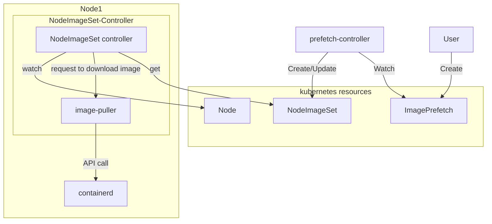
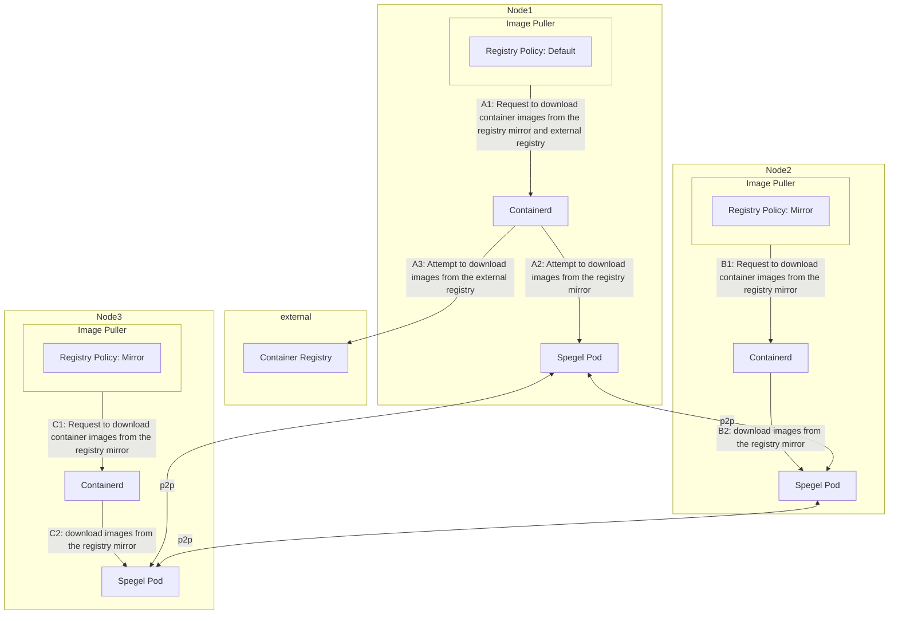

# Design Note

## Motivation

We are developing a custom Kubernetes operator to pre-download images for the following reasons:

Firstly, in our environment, we need to avoid downloading the same image multiple times when multiple Pods are created within the cluster, as this can lead to network throttling.
Secondly, to prepare for potential container registry failures, it is necessary to download images into the cluster before creating or updating workloads.
Lastly, none of the existing operators could meet our requirements.

### Goal

- Provide the capability to pre-download images required for workloads.
- Ensure that images are present on the necessary nodes within the cluster.
- Avoid downloading the same image multiple times within the cluster.

### Non-goal

- Automatically listing images required for workloads.
- Supporting various container runtimes (initial implementation supports only containerd).
- Limiting network traffic during image downloads.
- Deleting downloaded container images.
- Verifying the proper functioning of downloaded container images.

## User Stories

This section describes user stories.

- Assume that the Kubernetes cluster in the user stories is operated in an on-premises environment.
  - The team managing the Kubernetes cluster is referred to as the cluster administrators.
  - The team using the Kubernetes cluster is referred to as the tenant team.
  - Container images are downloaded from an external container registry over the internet.
  - There is sufficient bandwidth from the cluster to the internet, but network throttling may occur if the network load becomes too high.

### User Story 1

When the tenant team creates or updates workloads that require a large number of Pods, the simultaneous creation of Pods results in the same image being downloaded multiple times. As a result, network throttling may occur. Since network throttling can cause the following issues, the cluster administrators want to avoid triggering it:

- Other workloads may be unable to download images.
- Clients may repeatedly attempt to download images without knowing when to retry, which can lead to intermittent network throttling.

The operator can control the source of image retrieval, allowing it to avoid downloading the same image multiple times within the cluster. This reduces the likelihood of network throttling even when a large number of Pods are created simultaneously.

### User Story 2

The tenant team wants to pre-download images to minimize downtime during workload creation or updates. By using the operator, the waiting time for image downloads is eliminated during workload creation or updates, minimizing downtime.

### Limitations

- These features assume that [spegel](https://github.com/spegel-org/spegel) is running within the cluster.

### Risk and Mitigation

- Security Risk
  - Users might be able to download unauthorized images to nodes within the cluster. This risk can be mitigated by restricting the repositories from which images can be downloaded.

## The actual design

ImagePrefetch Controller
- The ImagePrefetch controller is a Kubernetes custom controller that handles `ImagePrefetch` custom resources.
- The ImagePrefetch controller monitors the `ImagePrefetch` custom resource and creates the `NodeImageSet` custom resource.

NodeImageSet controller
- The NodeImageSet controller operates on each Node and downloads images based on the NodeImageSet custom resource.
- The NodeImageSet controller monitors `Node` resources and, if an image is deleted, it downloads the image again.

### Diagrams





### API

ImagePrefetch Resource
| Field            | Type                          | Required | Description                                                |
| ---------------- | ----------------------------- | -------- | ---------------------------------------------------------- |
| images           | []string                      | true     | List of images to pre-download                             |
| nodeSelector     | map[string]string             | false    | Specify the nodes to which the image should be downloaded  |
| replicas         | int                           | false    | Set the number of image download nodes                     |
| imagePullSecrets | []corev1.LocalObjectReference | false    | Secret used for authentication with the container registry |

```
kind: ImagePrefetch
metadata:
  name: sample
spec:
  images: 
    - ghcr.io/cybozu/ubuntu:24.04
  replicas: 2
  imagePullSecrets:
    - name: regcred
```

NodeImageSet Resource
| Field                   | Type       | Required | Description                                                    |
| ----------------------- | ---------- | -------- | -------------------------------------------------------------- |
| imageSet                | []ImageSet | true     | Copy of the images specified in ImagePrefetch's `.spec.Images` |
| registryPolicy          | string     | true     | Registry to use when downloading images                        |
| imagePullSecrets        | []string   | false    | Copy of the ImagePrefetch's `.spec.imagePullSecrets`           |
| nodeName                | string     | true     | Node to download images to                                     |
| imageDownloadRetryLimit | int        | false    | Number of retries to download images                           |

```
kind: NodeImageSet
metadata:
  name: worker1
spec:
  imageSet:
  - name: ghcr.io/cybozu/ubuntu:24.04
    registryPolicy: Default
  imagePullSecrets:
  - name: regcred
  nodeName: worker1
  imageDownloadRetryLimit: 3
```

## Alternatives

This section lists some existing systems and compares their features with those provided by our operator.

- [kube-fledged](https://github.com/senthilrch/kube-fledged)
  - kube-fledged provides a custom resource called ImageCache. By creating an ImageCache resource, Job resources are created to download images.
  - Since kube-fledged uses Job resources to download images, in environments with a large number of nodes, a significant number of Job resources may be created, potentially overloading the kube-apiserver.
  - Because multiple Job resources are created simultaneously, it is difficult to prevent the same image from being downloaded multiple times within the cluster.
- [OpenKruise ImagePullJob](https://openkruise.io/docs/user-manuals/imagepulljob)
  - OpenKruise provides a custom resource called ImagePullJob. By creating an ImagePullJob resource, you can specify which nodes to pre-download images to. OpenKruise downloads images to the specified nodes via the CRI.
  - To use the features of ImagePullJob, OpenKruise must be installed.
- [warm-image](https://github.com/mattmoor/warm-image)
  - warm-image provides a custom resource called WarmImage. By creating a WarmImage resource, a DaemonSet is created to download images.
  - Since warm-image uses a DaemonSet to download images, images are downloaded on all nodes. This means images may be downloaded to nodes where they are not needed.
  - No resource is provided to indicate whether images have been downloaded, so users must verify that the created DaemonSet is functioning correctly.
